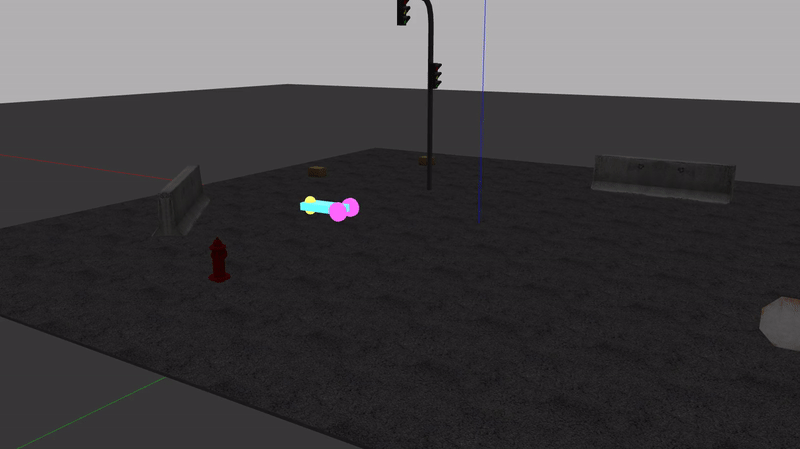

# Differential Drive and Arm Movement
* Arun Kumar
# Package List
See detailed READMEs within each package
- diff_drive - Contains xacro files for a differential drive robot viewable in gazebo and rviz. Nodes make the robot do different functions in gazebo.
- arm_move - Controls the px100 arm using either a fake node or the physical hardware. The package provides services to set and store arm waypoints. There is also a service to execute all waypoints in order. This package can be used for arm trajectory planning.

